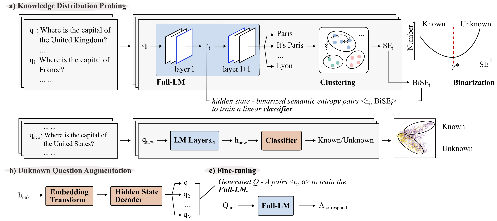

# KA2L: A Knowledge-Aware Active Learning Framework for LLMs

## 1. Project Structure



### 1. Knowledge Distribution Probe

*   main.py: Samples hidden states, text outputs, and outputs of various baselines during the training process.
*   train.py: Trains the MLP classifier based on the sampled data and calculates results for other baselines during the training process.
*   inference.py: Inference process, uses the trained classifier to perform knowledge distribution probe on new datasets.
*   plot.ipynb: Generates plots for training results.

### 2. Hidden States Decoding

*   train.py: Training process for the decoder.
*   inference.py: Inference process, decodes the detected problematic hidden states.

## 2. Commands

### 1. Knowledge Distribution Probe

config.json example

```json
{
  "run_name": "10k_llama3.1_8b_instruct",
  "model_name": "/data/LLM/Llama-3.1-8B-Instruct",
  "save_path": "/mydata/saves/medmcqa/10k_llama3.1_8b_instruct",
  "dataset_path": "/mydata/dataset/medmcqa_single",
  "log_level": "DEBUG",
  "entailment_deberta_path": "/data/LLM/deberta-v2-xlarge-mnli",
  "dataset_type": "medmcqa",
  "dataset_data_sample_size": 10000,
  "resume_from_checkpoint": "/mydata/saves/medmcqa/10k_llama3.1_8b_instruct/checkpoints/results/generation-result.pkl", # If first run, please remove this item
  "embeddings_from_layer_n": 31 # Takes effect only during inference
}

```

Commands

```shell
# Sampling
python3 main.py --config 10k_llama3.1_8b_instruct.json
# Train classifier
python3 train.py --config 10k_llama3.1_8b_instruct.json
# Inference
python3 inference.py --config 10k_llama3.1_8b_instruct.json
```

### 2. Hidden States Decoding Module

```shell
# Training
python train.py --per_device_train_batch_size 24 --per_device_eval_batch_size 24 --max_seq_length 128 --num_train_epochs 40 --max_eval_samples 1000 --eval_steps 100000 --warmup_steps 100000 --learning_rate 0.0002 --dataset_name /mydata/dataset/vec2text_25w_combined_5wmedmcqa --model_name_or_path /mydata/models/t5-base --use_wandb=0 --embedder_model_name /mydata/models/Llama-3.1-8B-Instruct --experiment inversion --bf16=1 --embedder_torch_dtype bfloat16 --lr_scheduler_type constant_with_warmup --use_frozen_embeddings_as_input 1 --mock_embedder 0 --embeddings_from_layer_n 31 --output_dir /mydata/saves/medmcqa_inversion_25k_combine/inversion_llama_3.1_8b_ins

# Inference
python3 inference.py /mydata/saves/medmcqa_inversion_25k_combine/inversion_llama_3.1_8b_ins /mydata/saves/kdp/medmcqa/llama3.1_medmcqa_unsure_5k.json
```